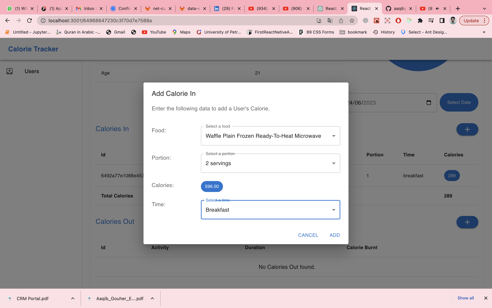

# lmd-consultancy-task
A basic calorie tracker where we can add users, edit and delete. After adding users, we add calories in, and calories out, and can get net calories for a particular day.

## Installation
### Frontend
Step 1: Open your terminal and navigate to the root directory of the cloned repository.

Step 2: **'npm install'**

Step 3: **'npm start'**

**Note:** This command will run the React development server, and you should be able to access the project in your web browser at http://localhost:3000.

### Backend
Step 1: Run the command **'npm install'** to install all the dependencies mentioned in the package.json file.

Step 2: Once the dependencies are installed, create an env file by looking at env.example with the correct data.

Step 3. Once the .env file is set up, we run an npm command **'npm run insert'**, which will insert the foods and activities data in the mongo db. Once done, you will get a message of successfully inserted.

Step 4. Start your application by running **'npm run dev'**. It will start at the port.

// **Note: Once done, start calling the endpoints.**

// **Postman colletion: [Postman Collection](./lmd_consultancy_collection.postman_collection.json)**

We are good to go now!

### Snapshots
* Users list page

* Add user page

* Users list after adding

* Delete user

* User details page

* Add calories in

* calories in the list

* Add calories out

* calories out of the list

